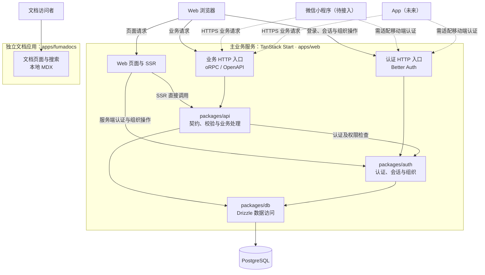
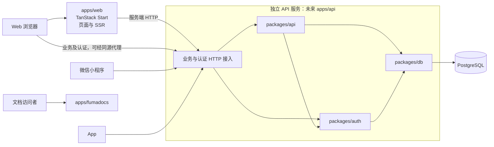

# 应用架构

## 系统范围

平台以用户的个人中心和组织业务空间为主线。用户登录后选择或创建组织，在所属组织内参与成员、团队及后续业务协作。平台管理身份独立于组织身份，详细规则见 [权限架构](authorization.md)。

Web 是当前主要访问端。微信小程序已有应用骨架，尚未接入主业务服务；App 属于未来接入端。公开文档由独立的 Fumadocs 应用承载。

## 当前部署与应用职责

现阶段 `apps/web` 的 TanStack Start 服务统一承载 Web 页面、SSR、业务 HTTP 接口和认证；`apps/fumadocs` 独立运行。未来小程序及 App 复用主业务服务，增加客户端本身不要求单独部署 API。

`packages/api` 是共享业务代码包，本身不是运行中的独立服务。业务代码按职责分包，服务部署先保持统一。

| 应用            | 职责                                      | 状态                       |
| --------------- | ----------------------------------------- | -------------------------- |
| `apps/web`      | 页面、SSR、认证 HTTP 接入和业务 HTTP 接入 | 当前实现                   |
| `apps/fumadocs` | 文档页面、导航和基于本地 MDX 的搜索       | 当前实现，不依赖主业务 API |
| `apps/mini`     | 微信小程序界面及未来移动业务访问          | 已有骨架，后端接入待实施   |
| App             | 原生或跨平台移动访问                      | 未来规划，技术方案尚未确定 |

### 当前架构与规划接入

实线表示当前关系，虚线表示规划接入。

## 服务内部职责

| 层次       | 职责                                            | 与其他层的关系                                   |
| ---------- | ----------------------------------------------- | ------------------------------------------------ |
| 页面与路由 | 页面组织、导航、数据加载与交互反馈              | 调用认证及业务接口，服务端完成最终授权           |
| HTTP 接入  | 将请求交给 oRPC、OpenAPI 或 Better Auth handler | 业务实现位于共享包                               |
| 认证与组织 | 登录、会话、组织、成员、邀请、团队和角色        | 复用 Better Auth；项目授权策略覆盖其直接端点     |
| 自定义业务 | 契约、输入输出校验、聚合查询及业务处理          | 通过 oRPC 实现，访问目标组织及具体资源前检查授权 |
| 数据访问   | Schema、关系、查询与事务                        | Drizzle / PostgreSQL，认证模型与插件配置一致     |

Better Auth 已提供的标准能力优先直接复用。组织归档／恢复、受限业务 DTO 和自定义聚合等由业务 API 补充；不能通过包装接口留下可绕过授权的原始端点。权限约束的完整定义见 [权限架构](authorization.md)，调用过程见 [请求与数据流](request-data-flow.md)。

## 当前接入能力

| 能力                 | 状态                                           | 代码入口                                                  |
| -------------------- | ---------------------------------------------- | --------------------------------------------------------- |
| 业务 HTTP            | oRPC 与 OpenAPI handler 复用同一 router        | [rpc.$.ts](../../apps/web/src/routes/api/rpc.$.ts)        |
| 同构业务调用         | 浏览器走 HTTP，SSR 使用 `createRouterClient`   | [orpc.ts](../../apps/web/src/utils/orpc.ts)               |
| 认证 HTTP            | GET / POST 交给 Better Auth                    | [auth.$.ts](../../apps/web/src/routes/api/auth.$.ts)      |
| 组织、团队与动态角色 | 服务端插件已启用，目标权限策略未完整落实       | [auth 配置](../../packages/auth/src/index.ts)             |
| 小程序登录           | 已调用 `wx.login`，code 换会话及凭证管理未实现 | [app.js](../../apps/mini/app.js)                          |
| 文档搜索             | 本地 MDX source                                | [search.ts](../../apps/fumadocs/src/routes/api/search.ts) |

平台 Admin、完整角色管理、组织归档等属于已确认待实施能力，见 [权限实施计划](../implementation/permissions.md)。

## 多端共用接口

多端共用业务集中在共享 API 契约与实现中。页面专属 Server Functions 适合 Web 会话、守卫及页面需求；对小程序和 App 提供可维护的业务 HTTP 接口。

oRPC 与 OpenAPI 复用业务实现。非浏览器客户端接入时需核对路径、序列化、错误结构及认证，不假定可以直接使用 Web 客户端代码。移动端可能长期使用旧版本，字段和行为保持兼容，破坏性变更明确版本及迁移方式。

小程序和 App 需要各自适配登录、凭证保存及会话续期，最终进入同一用户、组织与授权体系。浏览器 Cookie 流程不能直接假定适用于所有客户端。

## 条件性演进：独立 API 服务

| 实际需求                       | 统一部署的影响                 | 拆分收益                                   |
| ------------------------------ | ------------------------------ | ------------------------------------------ |
| API 流量明显高于页面流量       | 页面与 API 一起扩容            | 可独立分配 API 资源                        |
| Web 与 API 需要独立发布／回滚  | 同一服务发布相互关联           | 独立发布节奏                               |
| 页面渲染故障不能影响移动端 API | 共享运行资源，故障可能相互影响 | 隔离部分运行与发布故障，共享数据库仍需治理 |
| 不同团队独立负责 Web 与后端    | 协调同一服务部署               | 部署职责符合团队分工                       |

达到实际需求后再评估 `apps/api`。下面是尚未实施的演进方案。

拆分主要迁移 HTTP 入口及部署位置，继续复用业务实现。Web SSR 改为网络调用，处理凭证转发、超时和错误；认证客户端同步调整服务入口。对外地址保持稳定或提供迁移策略，避免要求所有移动客户端同时升级。

批量导入、报表生成等长任务可按需使用队列与 Worker。后台任务的资源需求与是否拆分 API 分别决策，不预先引入任务服务。
