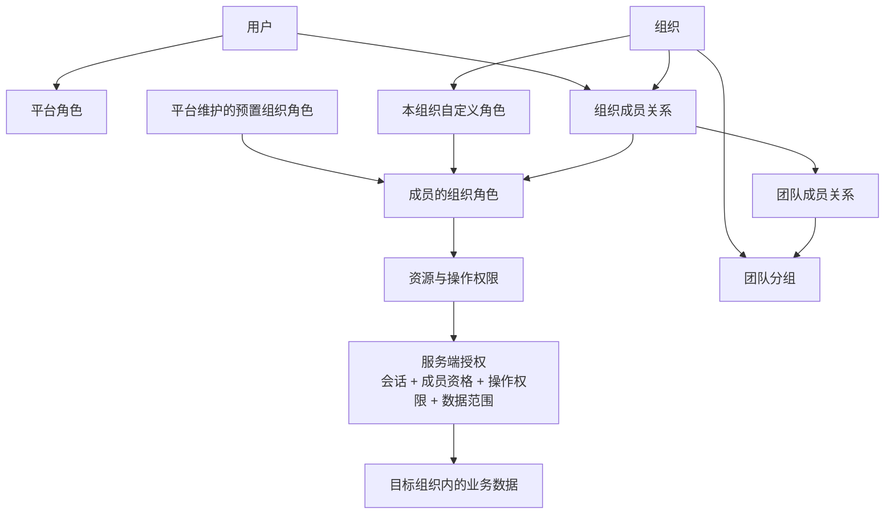
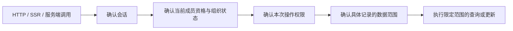

# 权限架构

## 设计范围与状态

已确认的第一版模型是「平台身份 + 组织角色 + 团队分组」。平台维护预置组织角色，每个组织获授权的管理者可以创建本组织的自定义角色。团队用于协作、成员分组和业务归属，不自动授予权限；第一版不引入部门树、团队角色或层级权限继承。

本文件是已批准的目标规则，尚不表示代码已完整落实。实施阶段、包能力核查与验收场景见 [权限体系实施计划](../implementation/permissions.md)。概念定义见 [领域词汇](GLOSSARY.md)。

## 身份与组织模型

用户注册后可以自助创建组织，创建者成为 owner。组织配额与套餐规则后续独立设计。

| 类型           | 作用范围           | 初始角色                 | 承载方式                  |
| -------------- | ------------------ | ------------------------ | ------------------------- |
| 平台角色       | 平台用户与会话管理 | 普通用户、平台管理员     | Better Auth Admin，待接入 |
| 预置组织角色   | 成员所属的某个组织 | `owner / admin / member` | Organization 静态角色配置 |
| 自定义组织角色 | 创建该角色的组织   | 从已声明权限中组合       | Organization 动态访问控制 |

平台管理员与组织管理员是独立身份，即使命名都为 `admin`，也分别定义和判断。平台身份不自动授予租户业务访问权；平台级组织停用等运营能力另行设计。

用户可加入多个组织，在不同组织拥有不同角色。第一版每个组织成员分配一个角色，可选预置角色或本组织的自定义角色；成员可以加入多个团队。Better Auth 1.7.7 的一次组合权限检查要求某一个角色满足整组权限，不能假定多个角色权限直接合并，因此第一版不开放多角色分配。

## 平台管理权限

第一版平台管理员可以查看用户、封禁／解封普通用户、查看并撤销会话，以及查看组织基础信息。会话管理输出排除 token 等凭证。

第一版不开放代用户登录、修改用户密码或邮箱、界面授予平台管理员及永久删除组织。限制覆盖服务端直接端点，不能仅隐藏页面。首位平台管理员通过受控部署初始化流程指定，不能自行注册获得。

## 预置组织角色

预置角色由平台代码统一定义，所有组织可用；组织管理者不能修改、删除或使用同名自定义角色覆盖。可复制其权限为本组织的独立自定义角色，副本保留复制时的组合，不跟随原角色更新；复制仍受权限授予范围约束。

第一版仅提供 `owner / admin / member` 及已实现组织管理能力的自定义组合。实际业务落地后再增加资源权限与通用业务角色，不预设财务、项目等尚未实现的角色。

| 能力                         | owner                  | admin                  | member         |
| ---------------------------- | ---------------------- | ---------------------- | -------------- |
| 查看组织基础信息             | 按成员资格允许         | 按成员资格允许         | 按成员资格允许 |
| 修改组织设置                 | 允许                   | 允许                   | 不允许         |
| 归档／恢复与所有权操作       | 允许，受所有权保护约束 | 不允许                 | 不允许         |
| 永久删除组织                 | 第一版不开放           | 不允许                 | 不允许         |
| 邀请、移除普通成员及分配角色 | 允许，受授予规则约束   | 允许，受授予规则约束   | 不允许         |
| 管理团队及团队成员           | 允许                   | 允许                   | 不允许         |
| 创建、修改、删除角色定义     | 默认允许               | 默认不允许，可明确委派 | 默认不允许     |
| 自定义业务操作               | 按资源明确配置         | 按资源明确配置         | 按资源明确配置 |

三个角色分别基于适合的内置能力扩展，不能全部继承 `adminAc`。admin 默认收回动态角色定义的写权限，只有明确授权的管理者可以管理角色定义。

## 自定义角色与授予边界

开发者声明资源及操作词表，组织管理者从中组合角色，不能创造服务端不认识的资源或操作。动态角色使用现有 `organizationRole`，不另外复制一套权限存储。

- 角色查找和分配限定目标组织；不同组织可以同名，同一组织内标识唯一并避开预置标识。
- 角色定义管理使用 `ac:create / read / update / delete` 等已有能力，owner 默认持有并可明确委派。
- 角色定义管理与成员角色分配分别授权。能创建角色不自动意味着能分配，能分配不自动意味着能修改角色定义。
- 管理者只能创建、修改或分配其授予范围内的角色，不能授予自己没有的操作。邀请及接受邀请路径执行同样约束。
- admin 只管理普通成员及权限不超过自身的自定义角色，不能任命、降级、移除其他 admin，不能修改自己的角色。受委派的自定义管理者同样受授予范围约束。
- admin 任免由 owner 负责。对复制或改名后具有 admin 等价能力的自定义角色也执行管理身份保护，不能只比较角色名称。
- 预置角色的保护由插件和服务端执行，不能只依赖隐藏按钮或 `isSystemRole` 标记。

Better Auth 1.7.7 的动态角色创建／修改已有所授予权限的检查；成员角色分配及邀请路径仍需按本规则核对实际保护范围，并通过受支持的扩展入口补齐。直接 Better Auth HTTP 和服务端 `auth.api.*` 调用必须一致受限，不能仅在 oRPC 包装接口执行规则。

## 角色变更与删除

自定义角色修改影响全部使用者。保存前显示受影响成员数量，下一次服务端操作按当前权限判断；前端失效对应缓存，具体机制见 [请求与数据流](request-data-flow.md#查询缓存与权限变化)。

成员或待接受邀请仍引用的角色不能删除。先调整成员角色、取消或重新发送邀请，再删除角色，不自动把成员降为 member。前端显示引用造成的阻止原因，服务端保存或删除时重新确认当前引用及授权。

## 所有权保护

一个组织可有多个同等所有权的 owner，始终至少保留一个。新增或调整 owner 身份是专门的所有权操作，授予前明确提示；自定义角色不能模拟 owner 身份。

最后一个 owner 不能退出、被移除或被降级，服务端需在并发操作下保持这一条件。仅先查询 owner 数量再更新，不能作为原子保护的保证；实现方式在实施阶段核查。

## 团队、信息可见范围与数据范围

团队维护协作关系，组织角色不随团队改变。组织管理员管理团队，团队参与者按具体业务规则协作，不增加通用团队授权体系。

普通成员可查看组织成员基础信息、团队列表、团队成员和自己的角色与权限。待处理邀请、完整角色管理与组织设置仅对具有对应权限的成员开放；网络响应、SSR 预取及序列化缓存同样限制字段。

操作权限与数据范围分别判断。例如具备任务更新能力，仍需满足任务属于目标组织及本人被分配或允许参与等规则。是否按团队限制某种资源，由具体业务定义，不假定所有业务共享同一范围规则。

业务请求明确目标组织，服务端验证当前成员资格，并在查询和更新条件中限定组织及适用资源范围。`activeOrganizationId` 表达当前操作上下文，不能代替授权。

## 服务端授权与页面消费

页面守卫按页面所需操作权限判断，菜单及按钮消费同一权限语义；owner 身份规则单独判断。页面和 UI 只提供访问体验，服务端是最终授权入口。

静态 `checkRolePermission` 只用于已配置的静态角色，动态角色由服务端权限结果反映。组织、用户与权限缓存的传递方式见 [请求与数据流](request-data-flow.md)。

## 组织生命周期

### 成员退出或移除

下一次服务端请求重新确认成员资格并拒绝该组织访问，旧会话、active organization 或前端缓存不能保留授权。清理该组织内的团队成员关系，刷新对应页面及缓存。

保留平台账号、其他组织身份和已完成业务记录的历史归属；历史业务记录不因成员移除而级联删除。最后一个 owner 的退出仍受所有权保护。

### 归档与恢复

第一版仅 owner 可以归档或恢复组织。归档保留组织及数据、停止普通业务访问；owner 仅可查看受限归档状态并使用恢复入口，不能继续普通组织业务。

归档检查覆盖组织、成员、团队、角色、邀请接受、组织激活、oRPC、Server Functions、SSR 和直接服务端调用。通过团队、角色或邀请标识定位组织时仍检查状态，不能仅从列表隐藏组织。

第一版服务端禁用永久删除入口，归档／恢复作为契约优先的业务接口实现，状态通过受支持的组织扩展字段及生成流程维护。永久清理与保留期限另行设计。决策背景见 [组织归档 ADR](../adr/0001-archive-organizations.md)。

## 当前实现与后续实施

Organization、Teams 与动态角色插件已启用，但当前三个静态角色均继承 `adminAc`；客户端权限检查仍主要基于静态角色名。Admin、完整授予限制、角色管理界面和归档能力尚未落实。

以上差距、代码入口和验收清单集中维护在 [权限实施计划](../implementation/permissions.md)，本文件维护产品规则与授权设计。
