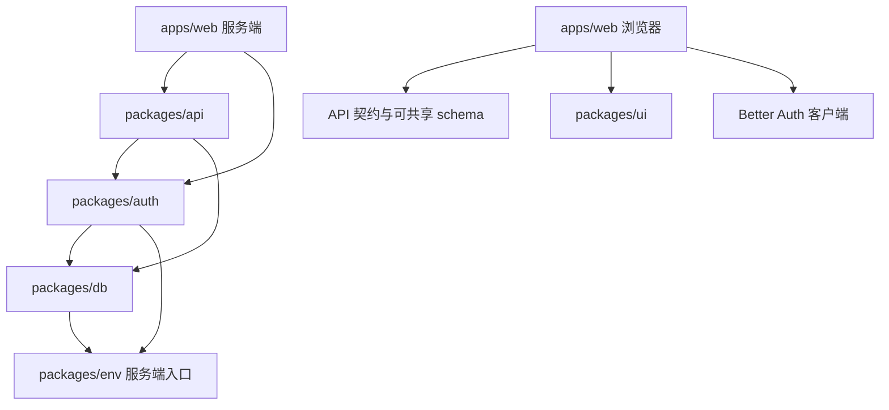

# 代码组织

## Monorepo 与职责划分

项目使用 Bun Workspaces。应用负责各访问端和部署入口，共享包承载跨端可复用的能力。共享代码包不等于独立部署服务，部署关系见 [应用架构](application.md)。

```text
org-saas/
├── apps/
│   ├── web/                 # TanStack Start 主业务应用
│   ├── fumadocs/            # 独立文档应用
│   └── mini/                # 微信小程序
├── packages/
│   ├── api/                 # 业务契约、处理器与认证中间件
│   ├── auth/                # Better Auth 配置、权限词表与会话入口
│   ├── db/                  # Drizzle 模型、关系与数据库连接
│   ├── env/                 # 服务端、Web 与移动端环境校验
│   ├── ui/                  # Web 共享组件、主题与样式
│   └── config/              # 共享 TypeScript 配置
└── docs/
    ├── architecture/        # 架构专题与领域词汇
    ├── adr/                 # 设计决策及原因
    └── implementation/      # 实施计划与验收
```

| 模块     | 职责                                          | 主要入口                                      |
| -------- | --------------------------------------------- | --------------------------------------------- |
| Web      | 公开页面、认证、个人中心、组织业务、HTTP 接入 | [Web 约定](../../apps/web/AGENTS.md)          |
| Fumadocs | 文档内容、路由及搜索                          | [文档应用约定](../../apps/fumadocs/AGENTS.md) |
| Mini     | 小程序页面、组件和未来接口接入                | [小程序约定](../../apps/mini/AGENTS.md)       |
| API      | Zod/oRPC 契约、自定义业务、共享访问检查       | [API 约定](../../packages/api/AGENTS.md)      |
| Auth     | 插件配置、权限定义、请求级 Session 读取       | [Auth 约定](../../packages/auth/AGENTS.md)    |
| DB       | 模型、关系、查询和事务                        | [DB 约定](../../packages/db/AGENTS.md)        |
| UI       | shadcn / Base UI 组件及 Web 主题              | [UI 约定](../../packages/ui/AGENTS.md)        |

微信小程序使用自身的 WXML、WXSS 和 TDesign，不直接复用 React UI。多端共享业务接口，而不是共享所有界面实现。

## 依赖方向与公开接口

服务端主依赖关系如下，图省略配置与 UI 细节。



应用通过 `@org-saas/*` 的公开 exports 使用共享包，各包避免反向依赖具体应用。契约和客户端可共享的 schema 保持浏览器可用；认证实例、数据库和服务端环境变量留在服务端。

API 契约与实现分开：`src/contracts/` 定义输入、输出与预期错误，`src/routers/` 实现业务，`src/index.ts` 集中公共 implementer、中间件、限流和日志。新增自定义业务先定义契约，再实现 router，具体规则见 API 约定。

## Web 内部组织

```text
apps/web/src/
├── components/              # 跨页面业务组件与 fallback
├── hooks/                   # 可复用 React hooks
├── lib/                     # auth-client、组织上下文、查询配置
├── functions/               # Web 所需的 Server Functions
├── middleware/              # TanStack Start 服务端中间件
├── utils/                   # guards、errors、同构 oRPC 客户端
├── routes/                  # 页面路由、布局及 HTTP 入口
├── router.tsx               # Router 与 QueryClient 创建
└── routeTree.gen.ts         # 路由工具生成
```

业务实现需要同时服务 Web、小程序和 App 时，放共享 API；仅用于 Web 会话、守卫或页面适配的服务端能力放 `functions/`。HTTP 路由接入协议并调用对应包，不在入口积累业务处理。

路由私有组件放同级 `-components/`，跨页面业务组件放 `components/`；通用视觉组件放共享 UI。目录形式、命名和编码规则以 [Web 约定](../../apps/web/AGENTS.md)及 UI 约定为准。

### 路由与布局分区

| 分区               | 路径／目录             | 职责                         | 状态                     |
| ------------------ | ---------------------- | ---------------------------- | ------------------------ |
| 公开页面           | `(public)`             | 落地页、关于、价格等         | 当前实现                 |
| 认证流程           | `(auth)`               | 登录及邀请接受               | 当前实现                 |
| 个人中心           | `/dashboard`           | 用户资料、组织选择与创建     | 当前实现                 |
| 组织空间           | `/org/$orgSlug`        | 概览、成员、团队与设置       | 当前实现，权限策略待完善 |
| 平台管理           | `/admin/*`             | 平台用户及组织基础信息       | 已确认待实施             |
| 组织角色与归档入口 | 组织空间内新增对应路由 | 角色管理、受限归档状态及恢复 | 已确认待实施             |

`(public)`、`(auth)` 是不增加 URL 层级的路由分组。`/dashboard` 和组织空间使用各自布局；组织父路由解析组织并提供上下文。路由权限及归档恢复访问规则见 [权限架构](authorization.md)，上下文运行过程见 [请求与数据流](request-data-flow.md)。

## 生成文件与模型

路由树由 TanStack 工具生成，组件与页面变化从路由源文件进入生成流程。认证模型与 Better Auth 插件配置同步，通过生成流程维护，保留已有关系与约束；数据库应用步骤遵循 DB 约定。

生成文件是工具输出，架构文档只解释其来源和职责。具体脚本、编译配置与格式化配置以仓库配置为准，避免复制一份容易过时的配置清单。

## 功能放置判断

| 需求                                                       | 放置位置                           |
| ---------------------------------------------------------- | ---------------------------------- |
| Better Auth 已提供的用户、组织、成员、邀请、团队或角色操作 | 认证配置及对应客户端调用           |
| 多端自定义业务、聚合查询、归档／恢复                       | API 契约与 router                  |
| Web 页面、布局、导航和用户反馈                             | Web 路由与业务组件                 |
| Web 会话读取、页面守卫所需服务端适配                       | Web Server Functions 与 middleware |
| 跨页面业务组件                                             | Web `components/`                  |
| 通用视觉组件或主题                                         | 共享 UI                            |
| 模型、关系、索引和事务支持                                 | DB，遵循生成及应用流程             |

分包目的是集中职责与变化原因，不为每个功能增加转发层或独立服务。实际依赖、公开接口及客户端／服务端边界发生变化时，同步更新本文件。
