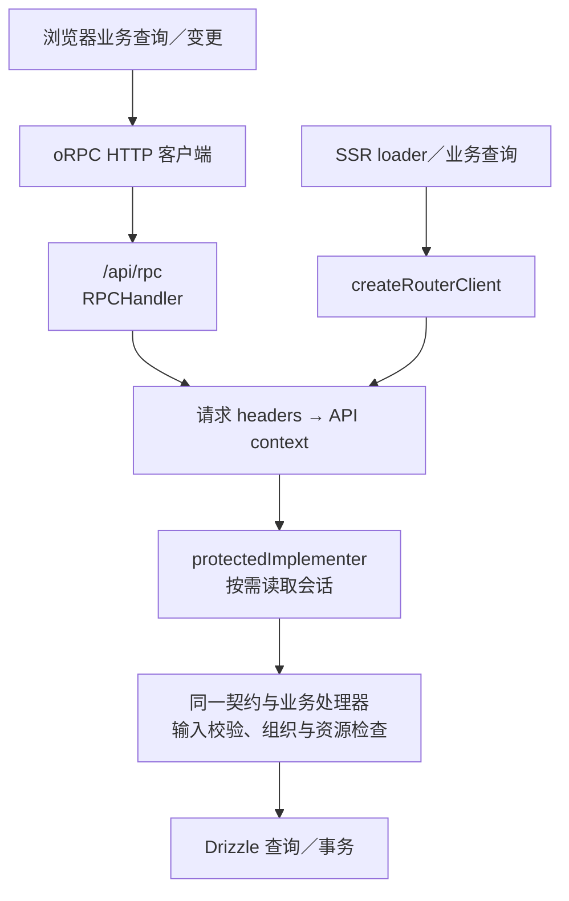

# 请求与数据流

## 当前运行机制

业务调用由同构 oRPC 客户端统一接入：浏览器使用 HTTP，SSR 在服务端直接调用同一处理器。认证和标准组织能力使用 Better Auth；Web 页面守卫通过 Server Functions 获取会话和组织上下文。

本文解释运行机制。具体写法遵循 [Web 约定](../../apps/web/AGENTS.md)和 [API 约定](../../packages/api/AGENTS.md)，目标授权规则见 [权限架构](authorization.md)。

## 浏览器与 SSR 的业务调用

[同构客户端](../../apps/web/src/utils/orpc.ts)在浏览器创建 `RPCLink` 并携带 Cookie，在服务端创建 `createRouterClient` 并传入当前请求 headers 和限流器。SSR 路径省去服务到自身的 HTTP 往返，仍经过同一契约及处理器检查。

[HTTP 入口](../../apps/web/src/routes/api/rpc.$.ts)同时挂载 oRPC 与 OpenAPI handler，复用同一业务 router；外部客户端使用 HTTP，也必须经过相同服务端授权。handler 负责协议接入，具体业务位于共享 API 包。

当前公共处理器与受保护处理器分别从 `publicImplementer` 和 `protectedImplementer` 实现。后者仅保证登录；组织成员资格、目标资源范围由业务进一步检查，已确认的完整操作权限和归档策略尚待实施。

## 请求级 Session 提取

会话提取统一通过 [createSessionGetter](../../packages/auth/src/session.ts)。它绑定本次请求 headers，第一次调用才执行 `auth.api.getSession`，并在同一 getter 内复用 Promise；不会跨请求保存会话。

| 入口                            | 创建与消费方式                                                                                                                                    |
| ------------------------------- | ------------------------------------------------------------------------------------------------------------------------------------------------- |
| TanStack Start Server Functions | [authMiddleware](../../apps/web/src/middleware/auth.ts)注入 `headers` 与 `getSession`，handler 按需调用 getter                                    |
| oRPC                            | [createContext](../../packages/api/src/context.ts)创建 getter，[认证中间件](../../packages/api/src/index.ts)读取会话并向 handler 注入非空 session |
| SSR 直接 oRPC 调用              | 同样创建 API context，执行相同认证中间件                                                                                                          |

Middleware 注入的是读取能力，不是提前取得的 session。公共业务不需要为所有请求预先读取会话；受保护入口按需获取。浏览器不导入服务端 getter，也不自行解析 Cookie 或替代 Better Auth Session。

组织成员资格与动态权限是另外的授权事实，不能因取得 session 就省略检查。下一次请求的授权失效规则见权限架构。

## 调用通道与职责

| 通道                                | 运行方式                                     | 用途                                              |
| ----------------------------------- | -------------------------------------------- | ------------------------------------------------- |
| `createServerFn` + `authMiddleware` | handler 在服务端执行；浏览器调用通过框架传输 | Web 会话读取、路由守卫、组织解析与页面所需适配    |
| `authClient.*`                      | 通过 Better Auth HTTP 接口                   | 登录、标准组织查询和写操作，结果可纳入 Query 缓存 |
| `auth.api.*`                        | 服务端调用 Better Auth                       | 持有请求 headers 的会话与标准组织操作             |
| `orpc.*`                            | 浏览器 HTTP，SSR 直接处理器                  | 多端共用的自定义业务、聚合查询及目标归档接口      |

先根据能力归属选择 Better Auth 或业务 API，再根据调用位置选择客户端或服务端入口。业务在 SSR 中运行时仍复用 oRPC 实现，不能因为是 loader 就把多端业务改写为页面专属 Server Function。

Better Auth 查询参与 SSR 预取时，应核对当前请求凭证的传递；不能假定浏览器客户端在服务端运行就自动拥有用户 Cookie。

## Router 与查询缓存

[Router](../../apps/web/src/router.tsx)为每个 Router 实例创建 QueryClient，并通过 Router context 和 QueryClientProvider 提供给 loader 与组件。Router 负责导航和触发数据加载，Query 负责查询缓存和失效。

需要导航前准备的数据，由 loader 使用共享 query options 预取，组件消费对应缓存。Loader 与组件引用同一查询配置，避免数据来源和缓存键不一致；具体编码规则在 Web 约定维护。

当前 Router 使用意图预加载，并将预加载数据的新鲜度判断交给 Query。SSR 预取结果向浏览器缓存的传递应按实际集成验证，不能把仅存在 QueryClientProvider 当作缓存脱水／水合已完成的证据；本次文档迁移没有修改该集成。

## 组织上下文与切换

当前组织父路由在 `beforeLoad` 中调用 [resolveOrgBySlug](../../apps/web/src/functions/auth.fn.ts)：

1. 从 getter 读取当前用户会话。
2. 通过 slug 调用 `auth.api.setActiveOrganization`，传入请求 headers。
3. 使用 `getActiveMember` 获取当前组织成员角色。
4. 将 user、org、role 交给 Router context，再由布局提供 OrgContext。

成员及团队查询使用显式 orgId，缓存键包含组织标识。组织切换通过导航进入对应 slug，并再次解析组织上下文。

`activeOrganizationId` 属于共享 session 状态。多个标签页进入不同组织时会改变 active 状态，因此请求目标组织尽量明确传入，服务端重新检查成员资格；不能以 active 值代替访问授权。当前按 active member 解析角色的过程也需在后续权限改造中核对多标签页竞态。

组织切换后尚有旧页面时，不依赖界面切换证明授权已改变；真正访问仍以本次请求的目标组织及服务端检查为准。

## 已确认的入口与导航规则

以下规则待路由重构实施，目标布局树见 [代码组织](code-organization.md#已确认的目标路由结构)。

- `/` 始终为公开首页，已登录用户也不自动跳转个人空间。登录成功且没有有效返回地址时默认进入 `/me`。
- 未登录进入受保护页面时跳转 `/login`，保留有效的站内返回地址；登录后回到目标页面，再检查组织或平台访问资格。已登录但无权限时显示拒绝访问，不循环跳转登录。
- 邀请页面位于共享登录层之外，展示最小必要信息，再引导登录或切换账号；服务端检查账号、邀请、组织状态及授予范围，接受成功后进入组织。
- `_authenticated` 共享会话检查；`me`、组织、`admin` 各自提供布局和导航。组织正常状态检查由 `_active` 承担，owner 的归档状态及恢复页面使用独立分支。
- 个人中心展示个人记录和组织入口，第一版不直接汇总各组织的内部数据。进入组织后使用该组织上下文，不更换账号。
- 个人收藏等记录归用户所有，切换组织后仍属于同一用户。资源详情按资源自身归属及访问范围安排；收藏不授予原内容访问资格，失去组织访问资格后不能经收藏继续读取受限内容。
- 旧 `/dashboard` 及其已有子地址迁移时提供相应重定向；API 独立返回协议结果，不套用页面登录跳转。

## 查询缓存与权限变化

当前组织查询配置集中在 [query-options.ts](../../apps/web/src/lib/query-options.ts)，组织完整信息使用组织维度键，组织列表使用用户当前会话对应的列表查询。变更成功后使受影响查询失效，由引用相同查询配置的消费者更新。

已确认待实施的权限缓存按当前用户与 orgId 划分。角色定义／成员角色改变、退出组织、组织归档／恢复后，失效相应权限和业务缓存，并更新路由上下文；退出登录或切换账号时清理旧授权结果。

第一版不要求实时推送。另一客户端可能暂时显示旧按钮，但下一次服务端操作按当前授权判断并反馈，前端缓存不能延长实际权限。

普通成员可见范围也作用于响应 DTO 和 SSR 预取数据，不能先缓存完整受限数据再仅隐藏组件。完整规则由权限架构维护。

## 错误传播与反馈

| 来源                   | 传播方式                                                                                         | 消费位置                      |
| ---------------------- | ------------------------------------------------------------------------------------------------ | ----------------------------- |
| 路由会话／角色检查     | 当前使用 `UnauthorizedError`、`ForbiddenError`；目标规则将未登录导航转为带有效返回地址的登录跳转 | 登录页或对应 fallback         |
| 页面资源不存在         | `NotFoundError` 或路由未匹配                                                                     | 对应 not-found 页面           |
| oRPC 预期业务失败      | 契约中的预期错误及 `ORPCError`                                                                   | Query／mutation、页面错误反馈 |
| Better Auth 客户端操作 | 返回值中的 `error`                                                                               | 操作表单和事件处理反馈        |
| 未知异常               | 服务端日志及通用错误路径                                                                         | 通用错误边界，不公开内部细节  |

[根路由](../../apps/web/src/routes/__root.tsx)识别访问错误并渲染对应 fallback；Router 的默认错误组件处理通用导航错误。Better Auth 操作检查返回的错误，业务查询与变更使用共享错误语义，避免把认证、授权和资源不存在都当作同一种失败。

页面反馈、toast、表单和对话框的编码规则见 Web 约定；本文件只说明错误从入口传播到消费者的关系。
