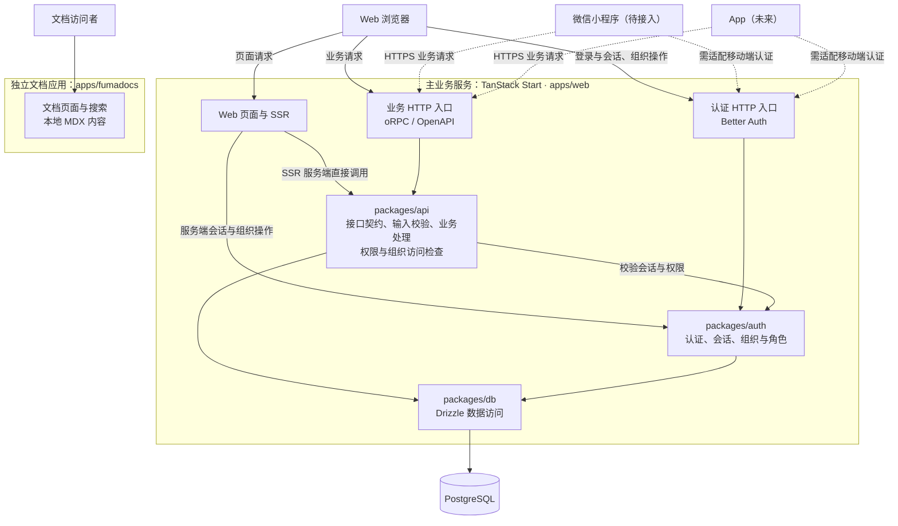
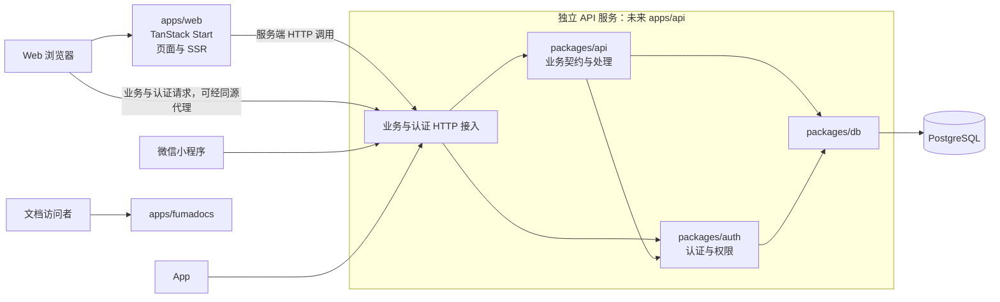

# 多组织 SaaS 平台架构设计

## 1. 总体架构

平台采用「个人中心 + 组织管理」的双层结构。用户登录后进入个人 Dashboard，从中选择或创建组织；进入组织后在独立的组织上下文中操作成员、团队、设置等功能。

### 服务部署决策

现阶段由 `apps/web` 的 TanStack Start 服务统一承载 Web 页面、业务 HTTP 接口和认证；文档由 `apps/fumadocs` 独立承载。小程序及未来 App 复用主业务服务，不因增加客户端而单独部署 API 服务。

业务代码按职责拆分为共享包，部署服务先保持统一：`packages/api` 是业务代码包，不是独立运行的服务。HTTP 路由负责协议接入，业务接口契约、输入校验、业务处理与访问检查集中在共享包中。

### 推荐架构图

实线表示现有调用关系；虚线表示小程序及 App 的规划接入。



### 已实现能力与接入计划

| 内容           | 当前状态                                                               | 代码入口                                                  |
| -------------- | ---------------------------------------------------------------------- | --------------------------------------------------------- |
| 业务 HTTP 接入 | oRPC 与 OpenAPI handler 复用同一个业务 router                          | [rpc.$.ts](../../apps/web/src/routes/api/rpc.$.ts)        |
| Web 同构调用   | 浏览器通过 HTTP 调用；SSR 通过 `createRouterClient` 直接调用业务处理器 | [orpc.ts](../../apps/web/src/utils/orpc.ts)               |
| 认证接入       | GET / POST 请求交给 Better Auth                                        | [auth.$.ts](../../apps/web/src/routes/api/auth.$.ts)      |
| 小程序         | 已调用 `wx.login`，尚未实现 code 换取服务端会话、业务请求和凭证管理    | [app.js](../../apps/mini/app.js)                          |
| App            | 未来接入，需确定客户端技术和认证方式                                   | —                                                         |
| 文档搜索       | 基于本地 MDX 内容，当前不依赖主业务 API                                | [search.ts](../../apps/fumadocs/src/routes/api/search.ts) |

### 多端共用接口的约束

- 多端共用业务通过 `packages/api` 定义契约并实现，不仅放在页面 loader 或页面专属 Server Function 中。Web 的路由守卫和会话读取可继续使用 Server Functions。
- oRPC 与 OpenAPI 复用业务实现。小程序或非 TypeScript App 接入时，核对 HTTP 路径、序列化方式、错误结构和认证；不能假定可以直接使用 Web 客户端代码。
- 移动端可能长期使用旧版本，接口字段与行为应保持兼容。发生破坏性变更时明确版本与迁移方案，不能依赖客户端与后端同时发布。
- 小程序与原生 App 需要适配登录、凭证保存和会话续期，最终复用统一的用户、会话与组织权限体系；不假定浏览器 Cookie 流程可以直接复用。
- SSR 直接调用与 HTTP 调用复用相同的输入校验和服务端访问检查。组织数据必须验证目标组织的访问资格并限制查询范围。

### 独立 API 服务的拆分条件

| 实际需求                               | 当前统一部署的影响                     | 拆分后的收益                                         |
| -------------------------------------- | -------------------------------------- | ---------------------------------------------------- |
| API 流量明显高于页面流量，需要分别扩容 | 页面与 API 一起扩容                    | 可单独分配 API 资源                                  |
| Web 与 API 需要独立发布、回滚          | 同一服务的发布相互关联                 | 独立控制发布节奏                                     |
| 页面渲染故障不能影响移动端 API         | 两类请求共享运行资源，故障可能相互影响 | 隔离部分运行与发布故障，数据库等共享依赖仍需单独治理 |
| 不同团队独立负责 Web 与后端            | 需要协调同一服务的部署                 | 部署职责更符合团队分工                               |

增加小程序或 App 本身不构成拆分理由。出现上述实际需求后，再评估新增 `apps/api`。批量导入、报表生成等长任务可按需引入队列与 Worker，是否增加后台任务服务与是否拆分 API 分别决策。

### 未来拆分架构图

以下为满足拆分条件后的演进方案，尚未实施。



拆分主要迁移 HTTP 入口与部署位置，继续复用共享包中的业务实现。Web SSR 改为通过网络访问 API，需处理请求凭证转发、超时和错误；Web 的认证及组织调用也需指向新的服务入口。保持对外接口地址稳定或提供迁移策略，避免要求所有移动客户端同步升级。

### 职责分层

| 层级              | 职责                                      | 关键约束                                     |
| ----------------- | ----------------------------------------- | -------------------------------------------- |
| **路由层**        | 页面组织、布局嵌套、导航守卫              | 文件系统路由，路由守卫在 `beforeLoad` 中执行 |
| **Auth 层**       | 认证、组织 CRUD、成员/邀请/团队管理、RBAC | 写操作和标准查询直接走 Better-Auth 客户端    |
| **API 层 (oRPC)** | 仅处理 Better-Auth 不提供的自定义业务逻辑 | 尽量精简，避免重复封装 Auth 已有能力         |
| **数据层**        | Schema 定义、关系映射                     | Auth 相关表由 Better-Auth 管理，不手动修改   |

---

## 2. Auth 与 API 的边界原则

### Better-Auth 直接负责

所有组织/成员/邀请/团队的标准 CRUD 操作，前端通过 `authClient.organization.*` 调用。Better-Auth 端点内置权限校验，无需额外 middleware。

### oRPC 仅补充

Better-Auth 不提供的聚合查询或自定义业务逻辑（如多表 join 统计、自定义 profile 更新）才通过 oRPC procedure 实现。

### 扩展指引

新增业务功能时，先确认 Better-Auth 是否已有对应端点。只有确认没有时才创建 oRPC procedure。oRPC procedure 统一使用 `protectedProcedure`，不创建自定义的 orgProtectedProcedure — 组织级权限由 Better-Auth 或在 procedure 内部按需检查。

---

## 3. 权限架构（三层防御）

### 第一层：路由守卫

在 `beforeLoad` 中执行，拦截未授权访问：

- **requireSession** — 验证登录态，未登录抛 `UnauthorizedError`
- **requireAdmin / requireOwner** — 验证组织角色，不满足抛 `ForbiddenError`
- **组织解析** — `/org/$orgSlug` 路由在 `beforeLoad` 中调用 `setActive` 验证成员身份并注入上下文

### 第二层：UI 组件层

基于 `usePermission` hook 同步判断，零网络开销。用于控制按钮/操作的可见性，不做安全保证。

### 第三层：服务端校验

- Better-Auth 端点内置权限检查（如 `inviteMember` 自动验证 invitation:create 权限）
- oRPC 自定义 procedure 内根据 session 和 membership 手动校验

### 扩展指引

新增受保护页面时，在对应 `route.tsx` 的 `beforeLoad` 中调用合适的守卫函数。新增操作按钮时，用 `usePermission` 控制渲染。服务端永远是最终防线 — 不能仅依赖前端权限检查。

---

## 4. 路由架构

### 路由分区

| 分区     | 路径前缀          | 布局            | 认证要求        |
| -------- | ----------------- | --------------- | --------------- |
| 公开页   | `(public)/*`      | Header + Footer | 无              |
| 认证流   | `(auth)/*`        | 居中卡片        | 无（半认证）    |
| 个人中心 | `/dashboard/*`    | 侧边栏          | 登录            |
| 组织管理 | `/org/$orgSlug/*` | 组织侧边栏      | 登录 + 组织成员 |

### 布局嵌套

- `(public)` 和 `(auth)` 是 pathless layout group，不影响 URL
- `/dashboard` 和 `/org/$orgSlug` 是命名路由，自带独立布局
- 同级 pathless group 的 `index.tsx` 不能冲突（都映射到 `/`）

### 组织上下文传递

`/org/$orgSlug/route.tsx` 在 `beforeLoad` 中完成：

1. 调用 `setActive` 激活组织并验证成员身份
2. 获取当前用户的组织角色
3. 返回 `{ user, org, role }` 注入路由上下文
4. 组件层通过 `OrgContext.Provider` 向子路由提供组织信息

子路由通过 `useOrgContext()` 获取，调用 `authClient.organization.*` 时 Better-Auth 自动使用 `session.activeOrganizationId`。

### 扩展指引

在组织下新增模块（如 `/org/$orgSlug/projects`）：

1. 创建 `routes/org/$orgSlug/projects/index.tsx`
2. 在组织侧边栏 `navItems` 中添加入口
3. 通过 `useOrgContext()` 获取组织信息
4. 如需限制角色，在页面组件内调用 `requireAdmin(role)`

---

## 5. Session 与数据通道架构

### Session 提取模型

`auth.api.getSession()`（Better-Auth 底层 API）是唯一的 session 提取入口，仅在两处被直接调用：

| #   | 位置                                              | 场景                                                |
| --- | ------------------------------------------------- | --------------------------------------------------- |
| 1   | `middleware/auth.ts` — `authMiddleware`           | TanStack Start server functions（SSR / beforeLoad） |
| 2   | `packages/api/src/context.ts` — `createContext()` | oRPC procedures（HTTP / SSR 共用上下文）            |

`authMiddleware` 调用 `auth.api.getSession()` 后，将 `{ session, headers }` 注入 context。下游 server function 从 context 中读取，不再重复调用底层 API。

### 四种数据通道

#### 通道 A: `createServerFn` + `authMiddleware`

**运行环境**: 始终在服务端（SSR 和客户端导航均走 RPC 到服务端）

**适用**: `beforeLoad` 路由守卫、SSR 阶段数据获取

**注意**: 下表中的 server function 本身不调用 `auth.api.getSession()`，session 由 `authMiddleware` 统一提取并通过 context 传递。

| Server Function                                        | 用途                                                                                                    |
| ------------------------------------------------------ | ------------------------------------------------------------------------------------------------------- |
| `getSession()`（`functions/auth.server.ts`）           | 读取 `context.session` 返回登录态（`requireSession` 守卫、`user-menu` 的 useQuery）                     |
| `resolveOrgBySlug(slug)`（`functions/auth.server.ts`） | 用 `context.headers` 调用 `auth.api.setActiveOrganization` 等（`org/$orgSlug/route.tsx` 的 beforeLoad） |

#### 通道 B: `authClient.organization.*` 查询（通过 queryOptions）

**运行环境**: loader 中在服务端预取，组件中通过 `useSuspenseQuery` 消费缓存

**适用**: Better-Auth 内置查询，配合 loader + useSuspenseQuery 范式

| queryOptions                 | queryKey              | 页面                   |
| ---------------------------- | --------------------- | ---------------------- |
| `orgListQueryOptions()`      | `["organizations"]`   | dashboard、OrgSwitcher |
| `orgFullQueryOptions(orgId)` | `["org-full", orgId]` | members、teams         |

#### 通道 C: `authClient.organization.*` 在事件处理 / mutation 中

**运行环境**: 仅客户端

**适用**: 所有写操作（创建/更新/删除），用户触发的一次性动作

典型操作：`inviteMember`、`removeMember`、`updateMemberRole`、`create`、`delete`、`createTeam` 等。Better-Auth 端点内置权限校验，mutation 后通过 toast 反馈。

#### 通道 D: `orpc.*` (oRPC procedures)

**运行环境**: 浏览器通过 HTTP 请求 `/api/rpc/*`；SSR 通过 `createRouterClient` 在服务端直接调用相同的业务处理器。两条路径均执行输入校验与访问检查。

**适用**: Better-Auth 不提供的自定义业务逻辑（多表聚合、复杂查询）

| Procedure                 | 用途                             |
| ------------------------- | -------------------------------- |
| `orpc.dashboard.orgStats` | 组织统计（成员数/团队数/邀请数） |
| `orpc.user.updateProfile` | 更新用户名/头像                  |

### 通道选择决策树

```
需要在 beforeLoad 或 SSR 中使用？
  ├─ Yes → 通道 A (createServerFn + auth.api.*)
  └─ No → Better-Auth 有对应端点？
            ├─ Yes → 查询 → 通道 B (useQuery + authClient.*)
            │        写操作 → 通道 C (事件处理 + authClient.*)
            └─ No  → 通道 D (oRPC protectedProcedure)
```

### 缓存 key 约定

- 组织维度数据：`["org-full", orgId]`
- 跨组织数据：`["organizations"]`
- 所有 queryOptions 集中定义在 `lib/query-options.ts`，loader 和组件引用同一份定义

### 数据加载范式：loader + useSuspenseQuery

路由页面的数据加载统一采用 `loader` 预取 + `useSuspenseQuery` 消费的模式，不在组件中使用 `useQuery` + `isPending` / Skeleton。

**路由定义**：

```typescript
export const Route = createFileRoute("/org/$orgSlug/members/")({
  loader: async ({ context }) => {
    await context.queryClient.ensureQueryData(orgFullQueryOptions(context.org.id));
  },
  component: MembersPage,
});
```

**组件消费**：

```typescript
function MembersPage() {
  const { org } = useOrgContext();
  const { data } = useSuspenseQuery(orgFullQueryOptions(org.id));
  // data 直接可用，不需要 isPending 判断
}
```

**要点**：

- `loader` 中用 `await ensureQueryData()`，确保导航前数据就绪
- 组件中用 `useSuspenseQuery()`，数据保证可用
- loader 和组件必须引用同一个 `queryOptions` 函数（来自 `lib/query-options.ts`）
- 不写 `isPending` / Skeleton — 加载态由路由级 `pendingComponent` 统一处理
- `loader` 通过 `context` 访问父路由 `beforeLoad` 注入的数据（如 `context.org.id`）
- `defaultPreload: 'intent'` 使鼠标悬停 `<Link>` 时自动触发目标路由的 loader 预取
- `defaultPreloadStaleTime: 0` 让 Router 不做缓存，完全交由 TanStack Query 管理
- SSR dehydrate/hydrate 由 TanStack Start 框架自动处理，无需 `@tanstack/react-router-ssr-query`

### 缓存失效范式：invalidateQueries

mutation 成功后统一使用 `queryClient.invalidateQueries()` 而非 `refetch()`：

```typescript
const queryClient = useQueryClient();
// mutation 成功后
queryClient.invalidateQueries(orgFullQueryOptions(orgId));
```

**好处**：所有引用同一 queryKey 的组件自动刷新，不需要通过 props 传递 `onRefresh` / `onSuccess` 回调。

---

## 6. 数据流模式

### 组织切换

用户在 OrgSwitcher 中选择组织 → 导航到 `/org/:slug` → `beforeLoad` 调用 `setActive` 更新 session → 后续请求自动携带 `activeOrganizationId`。

### 多标签页注意事项

`setActive` 会修改 session 中的 `activeOrganizationId`。如果用户在多个标签页打开不同组织，后打开的标签页会覆盖前一个的 active 状态。当前代码都显式传了 `organizationId`，实际影响有限。后续可在 `window.focus` 事件中重新调用 `resolveOrgBySlug` 同步。

---

## 7. RBAC 模型

### 角色体系

| 角色       | 组织管理  | 成员管理       | 邀请      | 团队 | 自定义资源           |
| ---------- | --------- | -------------- | --------- | ---- | -------------------- |
| **owner**  | 更新/删除 | 全部           | 创建/取消 | 全部 | create/update/delete |
| **admin**  | 更新      | 创建/更新/删除 | 创建/取消 | 全部 | create/update        |
| **member** | —         | —              | —         | —    | create               |

### 资源与权限声明

权限通过 `createAccessControl` 定义 statement，每个 statement 声明资源支持的操作。角色通过 `ac.newRole()` 选择性继承操作权限。

### 扩展指引

新增业务资源（如 `project`）：

1. 在 `permissions.ts` 的 `statement` 中添加资源操作声明
2. 在各角色定义中分配对应权限
3. 前端用 `usePermission({ project: ["create"] })` 控制 UI
4. 服务端在 oRPC procedure 中按需检查

---

## 8. 组件设计规范

### 共享组件（`apps/web/src/components/`）

跨页面复用的组件放在此目录，如 `OrgSwitcher`、`UserAvatar`、`RoleBadge`。

### 路由私有组件（`-components/`）

仅在特定路由内使用的组件放在路由目录下的 `-components/` 子目录，如 `MemberTable`、`InviteMemberDialog`。dash 前缀确保不被路由生成器识别为路由文件。

### 表单规范

统一使用 TanStack Form + Zod 验证。所有 mutation 操作必须提供 Toast 反馈（成功/失败）。

### 对话框模式

受控对话框（`open` + `onOpenChange`）+ 操作回调（`onSuccess`），在父组件管理状态。

---

## 9. 错误处理

### 错误类型

| 错误类              | 状态码 | 触发场景             | UI 表现          |
| ------------------- | ------ | -------------------- | ---------------- |
| `UnauthorizedError` | 401    | 未登录访问受保护页面 | UnauthorizedPage |
| `ForbiddenError`    | 403    | 角色/成员身份不满足  | ForbiddenPage    |
| `NotFoundError`     | 404    | 资源不存在           | NotFoundPage     |

### 错误捕获链

路由 `beforeLoad` 抛出错误 → 根路由 `errorComponent` 按类型渲染对应 fallback 页面。Better-Auth 客户端错误通过返回值的 `error` 字段判断，不抛异常。

---

## 10. 目录结构速查

```
apps/web/src/
├── components/          # 全局共享组件
├── hooks/               # 自定义 hooks（use-permission）
├── lib/                 # 核心库（auth-client, org-context）
├── utils/               # 工具（guards, errors, orpc）
└── routes/
    ├── (public)/        # 公开页 + 布局
    ├── (auth)/          # 登录 + 邀请接受
    ├── dashboard/       # 个人中心（需登录）
    └── org/$orgSlug/    # 组织管理（需登录+成员）
        ├── members/     # 成员管理
        ├── teams/       # 团队管理
        └── settings/    # 组织设置（需 Admin+）

packages/
├── api/src/routers/     # oRPC 路由（精简：user + dashboard）
├── auth/src/            # Better-Auth 配置 + RBAC 权限
├── db/src/schema/       # Drizzle Schema
└── ui/src/components/   # shadcn/ui 组件库
```
